# Nestling — Baby Feeding Tracker & Reminders

> A calm, offline-first Flutter app that helps parents track feeds, care routines,
> appointments, diapers and weight — and never miss a feed thanks to a real
> full-screen alarm that rings even when the phone is locked.

**Platform:** Android (Flutter) · **Package:** `com.nestling.app`
**Live landing page:** https://allanweber.github.io/baby-reminder/
**Status:** Release-signed CI build, Play Store submission pack prepared.

---

## What it is

Nestling is a production-quality baby-care tracker built end-to-end in Flutter —
from the design system and custom widgets down to a native full-screen alarm
engine. It is **100% offline**: every record lives on the device, with no
account, no backend, no ads and no analytics in the app. Parents get a fast,
private, one-hand-friendly tool for the newborn months.

It began as a feeding logger and grew into a complete daily-care companion:
feeds, recurring care reminders, one-off appointments, diaper logs, weight
tracking, a merged daily report, and light/dark themes.

---

## Highlights (selling points)

- **Never miss a feed.** A countdown to the next feed fires a true OS-level
  alarm — full-screen, sound + vibration, over the lock screen — backed by
  `AlarmManager` and a foreground service, so it rings even if the app was
  swiped away.
- **One app for the whole routine.** Feeds, care reminders, appointments,
  diapers and weight in a single, coherent interface.
- **Appointments with two-stage alerts.** Doctor visits and vaccinations ring
  both a lead reminder (1 hour / 1 day before) *and* an at-time alarm, with
  list **and** calendar views.
- **Reusable feed tags.** Tag a feed ("Fussy", "Spit up", "Good latch"); tags
  are remembered and offered again, and surface across the feed list and report.
- **Private by design.** Fully offline; a transparent, consent-based analytics
  layer exists only on the marketing website, never in the app.
- **Own your data.** One-tap JSON backup & restore, versioned and
  forward-compatible.
- **Polished, accessible UI.** A hand-built design system (custom time/date
  pickers, a bespoke month calendar, animated alarm overlays), full light/dark
  theming, and reduced-motion support.
- **Shipped like a product.** GitHub Actions CI runs analyze + tests and builds
  a **release-signed App Bundle and APK** on every change; a marketing landing
  page ships via GitHub Pages.

---

## Features

### Feeding
- Log formula, expressed breast-milk bottles, and breastfeeding (by duration).
- Live "next feed" countdown with snooze and quick +5/+15/+30 nudges.
- Daily totals: intake, feed count, average gap between feeds.
- **Reusable tags** on any feed, shown as pills in the list and report.

### Care reminders
- Recurring reminders (daily-at-a-time or every-N-hours) for medicine,
  vitamins, tummy time and more, each with its own full-screen alarm.
- **Quick log** to record a care category on the spot, no schedule needed.
- "Missed" tracking with tap-to-mark-done-late.

### Appointments *(one-off dated events)*
- Doctor, Vaccination, Dentist, Checkup, Specialist, Therapy, Photos, Other.
- Optional title & description, a lead reminder (1 hour / 1 day / none) plus an
  at-time alarm, **Done** and **Postpone** actions, and an overdue state.
- **List and calendar views** (custom month grid with per-day dots).

### Diapers
- Log pee / poop / both, with colour and amount for health tracking.

### Weight
- Weigh-ins over time with the latest value, per-entry delta, and kg/lb display.

### Daily report
- A merged, time-sorted timeline of feeds, diapers, reminders and done
  appointments, filterable by category, with per-day navigation.

### System & polish
- Real full-screen alarm (sound, vibration, lock-screen takeover, "Stop" action).
- Custom on-demand timer that temporarily takes over the feed countdown.
- Light & dark themes; custom analog time picker and calendar date picker.
- JSON backup & restore (versioned, older backups import cleanly).

---

## Screens

| Feed & countdown | Log feed with tags | Care reminders |
| --- | --- | --- |
| 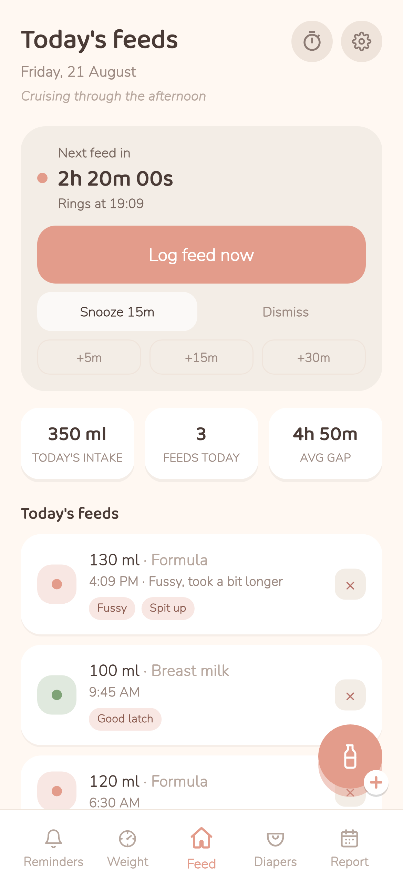 | 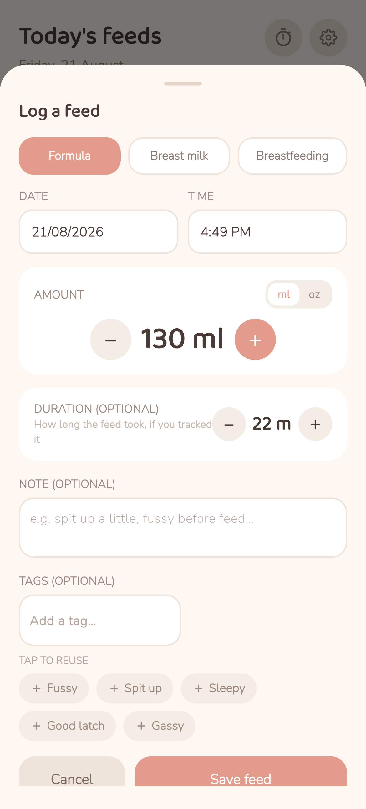 | 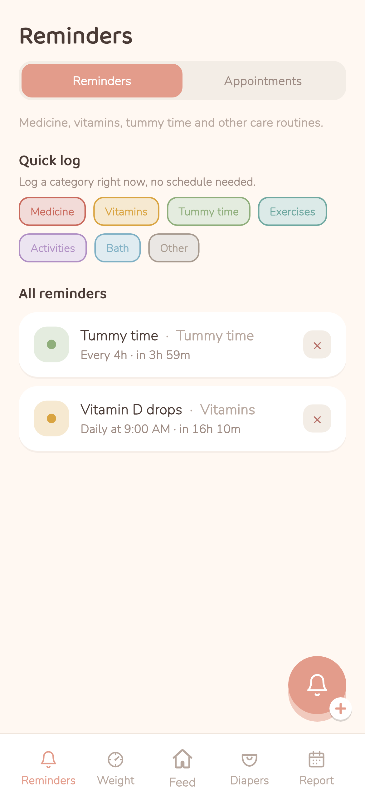 |

| Appointments — list | Appointments — calendar | Add appointment |
| --- | --- | --- |
| 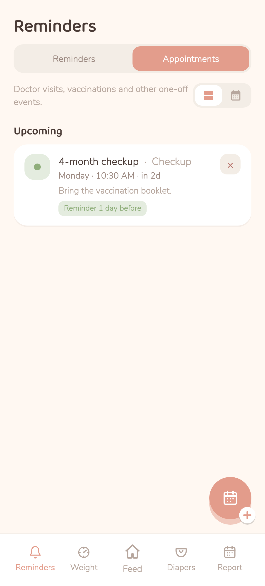 | 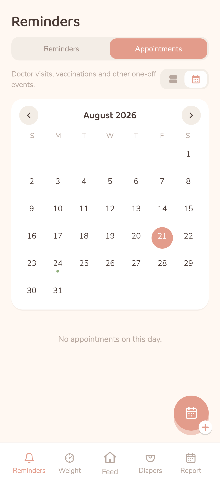 | 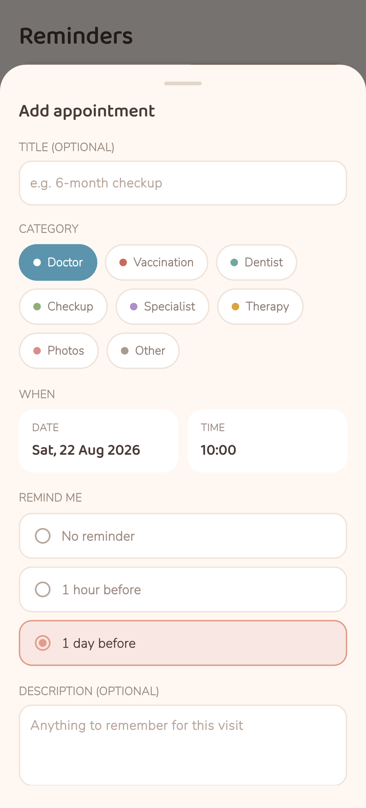 |

| Diapers | Log diaper | Weight |
| --- | --- | --- |
| 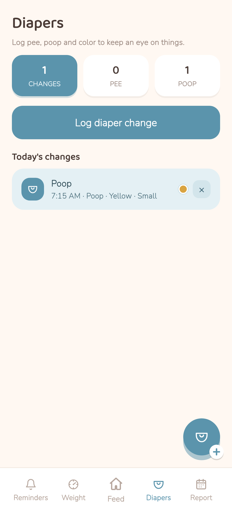 | 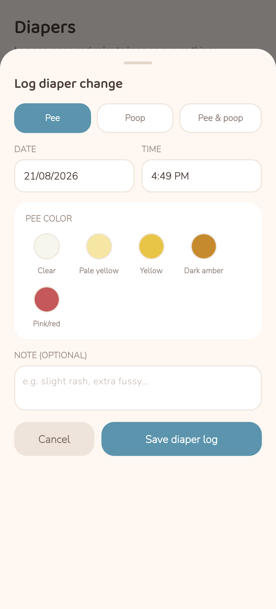 | 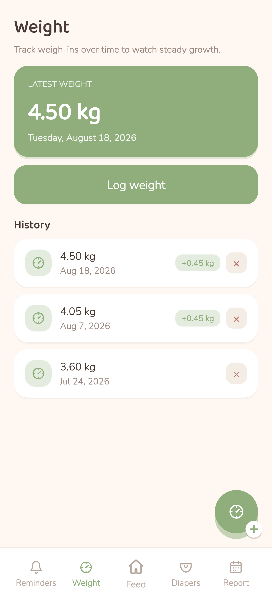 |

| Daily report | Settings | Dark mode |
| --- | --- | --- |
| 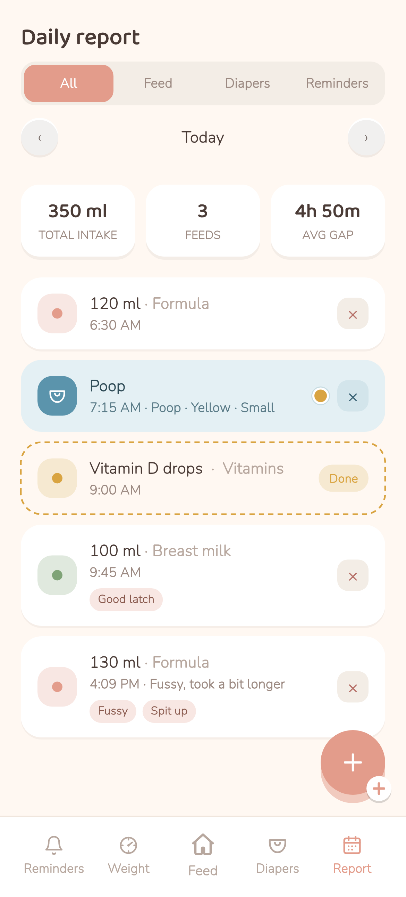 | 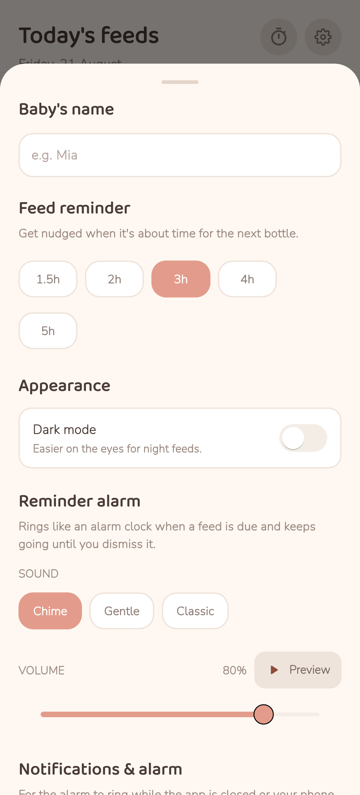 | 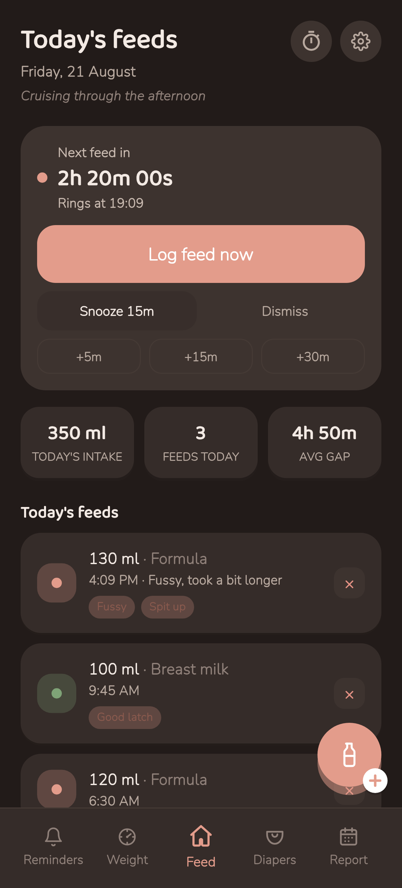 |

Dark mode carries through every screen, including appointments:

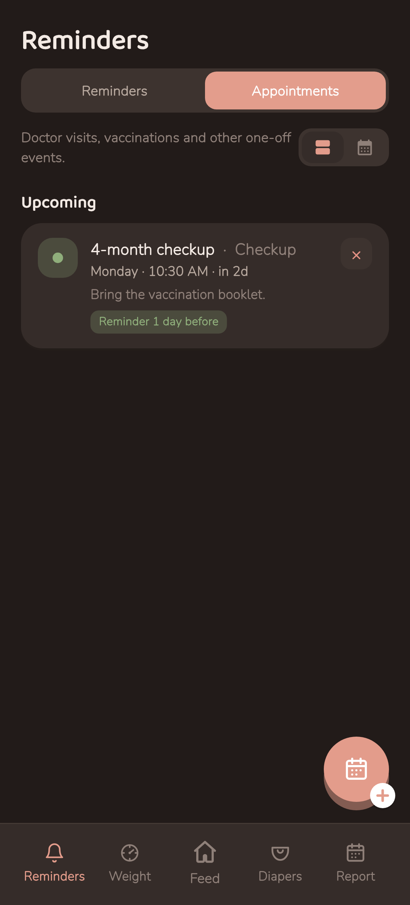

---

## Tech stack

- **Flutter / Dart** — single codebase, Material 3, custom design tokens.
- **State:** a lightweight `ChangeNotifier` app-state layer; ephemeral UI state
  kept in widgets.
- **Persistence:** `shared_preferences` (offline-first, JSON-serialised models).
- **Native alarms:** the `alarm` package (`AlarmManager` + foreground service +
  full-screen intent), `audioplayers` for previews, `flutter_local_notifications`
  for permission diagnostics.
- **Rendering:** `flutter_svg` for crisp line icons; custom painters for the
  analog clock, dashed report rows and calendar.
- **Quality:** unit + widget tests, `flutter analyze` clean, and a headless
  render harness that captures the screenshots in this folder.
- **CI/CD:** GitHub Actions — analyze, test, and a **release-signed** `.aab` +
  `.apk` on every push; keystore injected from secrets.
- **Web:** a self-contained marketing landing page deployed on GitHub Pages,
  with GDPR-compliant consent-based analytics and a privacy policy.

---

## Engineering notes

- **Reliable alarms are the hard part.** The app treats the native alarm engine
  as the single source of truth for "is an alarm ringing", mirrored into an
  in-app overlay, so a due feed rings identically whether the app is foregrounded,
  backgrounded, or killed — and survives device reboots.
- **Distinct alarm-id space.** Feed, care reminders and each appointment's two
  alarms (lead + at-time) draw from a managed id space so native alarms never
  collide, and imported backups keep the counter ahead of existing ids.
- **Forward-compatible storage.** Every model has defaulted JSON decoding, so a
  newer field (tags, appointments, weight) never breaks an older backup.
- **Design system first.** Colours, radii and typography live in one theme file
  with light/dark palettes swapped in a single frame, so the whole tree
  re-themes consistently.

---

## Links

- **Landing page (GitHub Pages):** https://allanweber.github.io/baby-reminder/
- **Privacy policy:** https://allanweber.github.io/baby-reminder/privacy-policy.html
- **Google Play (target):** `com.nestling.app`

*Screenshots in this folder are rendered directly from the app's widgets with
its production fonts, on seeded sample data.*
